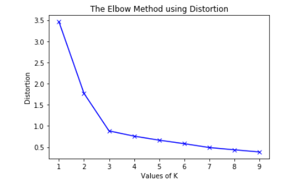
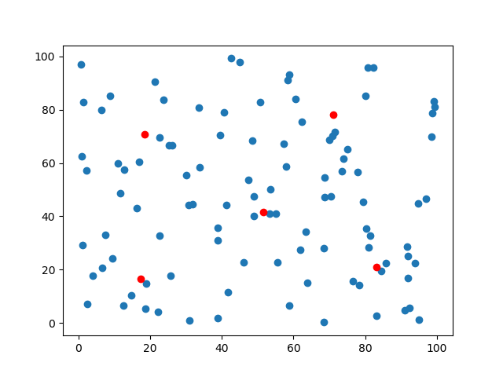

# 数学建模竞赛班 第二讲

## 知识点

``` flow
a=>operation: 聚类分析的作用
b=>operation: KMeans的原理
c=>operation: KMeans的选择
d=>operation: 聚类分析的应用
a->b->c->d
```

## 课程内容回顾

### KMeans

损失函数：
$$
J(θ_0,θ_1,θ_2,...,θ_n)=\sum_{i=1}^{n}(X_i - μ_{c^i})^2\\
μ_i \ means \ i_{th} \ cluster \ centers.\\
c_i \ means \ the \ index \ of \ i_{th} \ sample's \ cluster \ center.
$$


### K的选择

> 没有所谓最好的选择聚类数的方法，通常是需要根据不同的问题人工选择的。选择的时候思考我们运用 K-Means的目标是什么，然后选择最好的K的取值。
> 当人们在讨论，选择聚类数目的方法时，有一个可能会谈及的方法叫作“肘部法则”。
> 关于“肘部法则”，我们所需要做的是改变k值，然后计算相应的损失函数。



<center><i>ref: https://www.geeksforgeeks.org/elbow-method-for-optimal-value-of-k-in-kmeans/</i></center>

## 作业(选择一个或两个完成，两周)

1.



/cluster/k-means.py 将5个中心点标在了图表上，请修改程序，将100个蓝色的代表样本的数据点，依照其所属的类别，标上相应的颜色。

2.

/dataset/COMAP_RollerCoasterData_2018.xlsx 是2018年A题的数据集，请结合该数据集和题目要求，探索聚类分析在此题中可能的应用。

/dataset/HiMCM_TriDataSet.xlsx 是2016年A题的数据集，请结合该数据集和题目要求，探索聚类分析在此题中可能的应用。

请完成两个段落，分别说明在这两年中聚类分析的可能应用。

可以参照这样的格式：

1. what is cluster analysis?(briefly)
2. what problem do you intend to solve?
3. what's the process of implementaion?

eg. (2018)

​	pick Height/Speed/Length columns -> measure excited level.